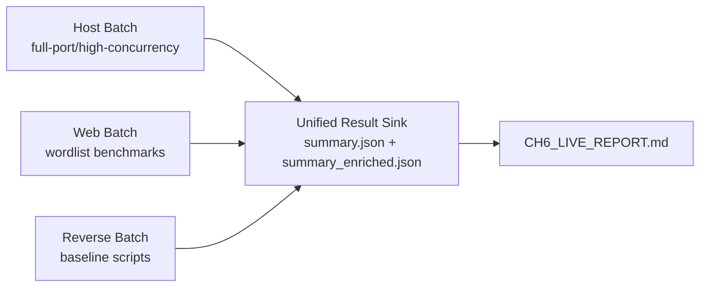
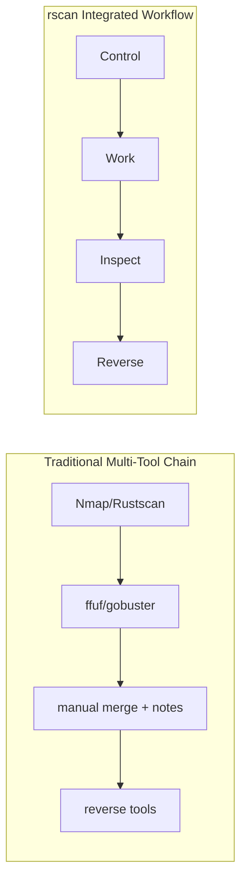
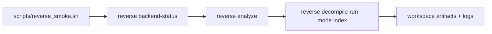

# Chapter 6 Figure Assets

Generated at: 2026-04-23 20:53:40 +0800
Target: 192.168.8.145
Output dir: /home/vr2050/RUST/rscan_codex/reports/ch6_live_20260423_205256

## Figure 6-6 / 6-7 (PERF panel)

Manual capture command:

```bash
cargo run --release -- tui
```

Capture from PERF panel fields: `MEM`, `RSS`, `CPU`, `LOAD`.

Code evidence file: `/home/vr2050/RUST/rscan_codex/reports/ch6_live_20260423_205256/PERF_OBSERVABILITY.md`.

## Figure 6-8 (Large-scale architecture)



## Figure 6-10 (Feature matrix)

| Tool | Host | Web | Vuln | Reverse | TUI/Zellij | Unified Task View |
|---|---|---|---|---|---|---|
| rscan | Yes | Yes | Yes | Yes | Yes | Yes |
| nmap | Yes | Partial(script) | NSE | No | No | No |
| rustscan | Yes | No | No | No | No | No |
| ffuf | No | Yes | No | No | No | No |
| gobuster | No | Yes | No | No | No | No |

## Figure 6-11 (Performance synthesis)

Use these two sources in one screenshot/composite:

1. `/home/vr2050/RUST/rscan_codex/reports/ch6_live_20260423_205256/summary_enriched.json` (live host/web timing + findings)
2. `scripts/web_bench_compare.sh` output directory (if generated)

## Figure 6-12 (UX flow compare)



## Figure 6-15 (Reverse chain)


